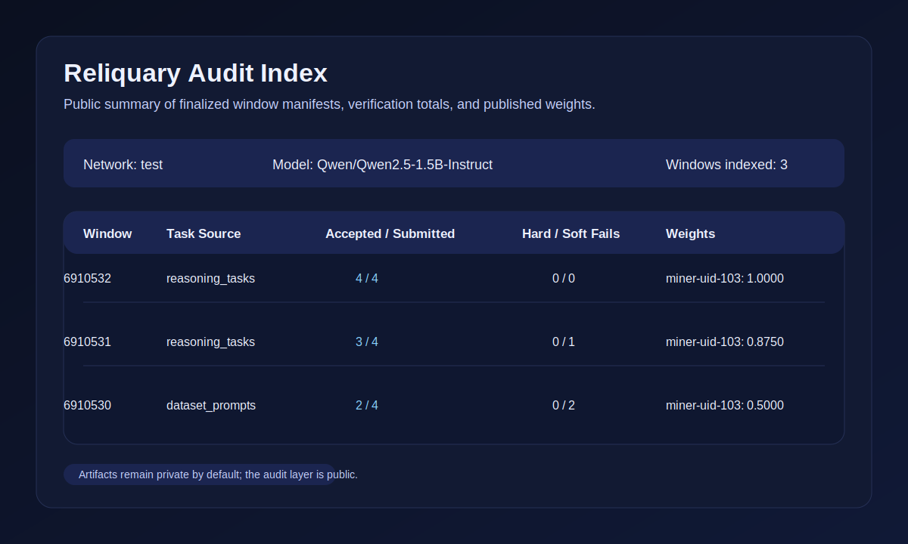

[](https://github.com/reliquadotai/reliquary-inference/actions/workflows/cpu-ci.yml)
[](https://www.python.org/)
[](docs/status.md)
[](LICENSE)

# Reliquary Ledger

**Reliquary Ledger** is the inference runtime for [Reliquary](https://github.com/reliquadotai/reliquary),
a proof-carrying Bittensor subnet that runs two companion protocols under a
single netuid: **Ledger** (inference) and **Forge** (training). Ledger produces
**verifiable completions**: miners generate solutions to deterministic tasks,
validators replay hidden-state sketch commitments, and a 4-validator mesh
publishes on-chain verdicts that gate weights and feed the Forge trainer.

Ledger and its companion [Reliquary Forge](https://github.com/reliquadotai/reliquary)
share a [protocol package](https://github.com/reliquadotai/reliquary-protocol) so the
two runtimes cross-verify deterministically inside the same subnet.



## Live Status

- **Testnet netuid 462** — 4-validator mesh + 1 real-model miner continuously
  running since 2026-04-21
- **Task source**: Hendrycks MATH (12 500 problems, Level 1-5) with bootstrap
  Level 1-2 filter
- **Proof system**: GRAIL sketch commitments + HMAC signatures + 9-stage
  verifier pipeline
- **Closed-loop bridge**: `CheckpointAttestation` + `PolicyCommitment` →
  miner-side `policy_consumer` hot-swap
- **DAPO zone filter**: σ ≥ 0.33 (bootstrap) group-relative gate feeds real
  GRPO training signal to Forge
- **Live dashboard**: `http://<validator>:9108/` (also `/healthz`, `/status`,
  `/metrics`)
- **Public audit**:
  - [HTML index](https://pub-954f95c7d2f3478886c8a8ff7a4946e0.r2.dev/audit/index.html)
  - [JSON index](https://pub-954f95c7d2f3478886c8a8ff7a4946e0.r2.dev/audit/index.json)

Sanitized operational status: [`docs/status.md`](docs/status.md).

## How It Works

```
┌───────────────────────────────────────────────────────────────────────┐
│                     Reliquary Ledger (netuid 462)                     │
│                                                                       │
│   1. Chain   block_hash → deterministic task batch (Hendrycks MATH)   │
│   2. Miner   M=8 sampled rollouts per prompt, GRAIL sketch + sig      │
│   3. Mesh    4 validators re-run forward pass, verify commitments,    │
│              score via evaluate_math_trace → signed verdicts          │
│   4. Zone    rollout groups with σ ≥ 0.33 mark in-zone for training   │
│   5. Weights validator sets on-chain weights from unique accepted     │
│              rollout count per miner                                  │
│                                                                       │
├───────────────────────── closed-loop bridge ──────────────────────────┤
│                                                                       │
│   6. Forge   pulls in-zone rollout groups, runs GRPO with PPO clip +  │
│              KL penalty, publishes signed delta + PolicyCommitment    │
│   7. Ledger  miners + validators apply delta at effective_at window;  │
│              next cycle mines with the updated policy                 │
└───────────────────────────────────────────────────────────────────────┘
```

## Quickstart

### Verify It Yourself (local demo, no chain writes)

```bash
git clone https://github.com/reliquadotai/reliquary-inference.git
cd reliquary-inference
cp env.example .env
uv venv && source .venv/bin/activate
uv pip install -e ".[dev]"
reliquary-inference demo-local
```

### Live Chain-Read Smoke Test (testnet, no signing)

```bash
bash deploy/testnet-readonly-smoke.sh
```

### Run a Testnet Validator (netuid 462)

See [`docs/validator-quickstart.md`](docs/validator-quickstart.md).

### Run a Testnet Miner (netuid 462)

See [`docs/miner-quickstart.md`](docs/miner-quickstart.md).

## Scope

**Included**
- Hendrycks MATH task source (live); `reasoning_tasks` + `dataset_prompts`
  retained as legacy fallbacks for tests and low-resource configs
- Single-GPU Hugging Face miner mode with M-batch generate (5-7× faster
  than serial sampling)
- Optional dual-engine miner mode (vLLM generation + HF proof replay)
- Nine-stage verifier pipeline: schema → tokens → prompt → proof →
  termination → environment → reward → logprob → distribution
- DAPO zone filter + 50-window per-prompt cooldown
- Local registry (development) and R2-backed REST registry (testnet)
- Public audit index (`audit/index.json` + `audit/index.html`) with
  10-minute rebuild timer
- `/healthz`, `/status`, `/metrics`, `/dashboard` HTTP endpoints with CORS
- PolicyConsumer with reparam-trick sanity guard on delta apply

**Excluded** (handled by [reliquary](https://github.com/reliquadotai/reliquary), the Forge training runtime)
- GRPO training
- Distillation packs
- Learner checkpoints
- Policy-authority publication

## Documentation

- [Overview](docs/overview.md) — what Ledger is, at a glance
- [Architecture](docs/architecture.md) — roles, data flow, proof layer
- [Protocol](docs/protocol.md) — nine-stage verifier pipeline
- [Scoring](docs/scoring.md) — incentive + weight derivation
- [Miner quickstart](docs/miner-quickstart.md)
- [Validator quickstart](docs/validator-quickstart.md)
- [Incentive mechanism](docs/incentive.md)
- [Audit surface](docs/audit.md)
- [Dashboard guide](docs/dashboard.md)
- [Monitoring](docs/monitoring.md)
- [Deployment](docs/deployment.md)
- [FAQ](docs/faq.md)
- [Current status](docs/status.md)
- [Readiness review](docs/readiness-review.md)
- [Release checklist](docs/release-checklist.md)
- [Protocol paper](docs/paper/reliquary_protocol_paper.md)
- [Narrative: how it works](docs/narrative/how_it_works.md)
- [Narrative: launch announcement](docs/narrative/announcement.md)

## Contributing

See [`CONTRIBUTING.md`](CONTRIBUTING.md) and [`SECURITY.md`](SECURITY.md).

## License

MIT. See [`LICENSE`](LICENSE).
