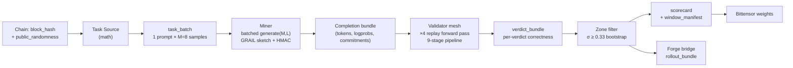
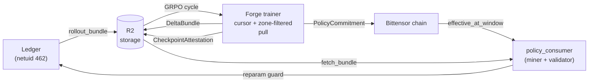

# Architecture

Reliquary Ledger is a proof-carrying inference subnet runtime with three
pluggable task sources and a closed-loop policy bridge to the Forge trainer.

## Task sources

- **`math` (live)** — Hendrycks MATH (12 500 problems across 5 difficulty
  levels and 7 subjects), loaded once and cached at module scope. Bootstrap
  filter `RELIQUARY_INFERENCE_MATH_MAX_LEVEL` restricts to Level 1-2 until
  the base model is strong enough for Level 3+. Correctness = boxed-answer
  exact match after conservative LaTeX normalization. This is the source
  driving the flywheel in production.
- **`reasoning_tasks` (legacy)** — deterministic arithmetic family with
  exact-answer validation and contamination tags. Used in tests and
  low-resource fallbacks.
- **`dataset_prompts` (legacy)** — deterministic HF dataset prompt selection
  with copycat filtering. Used in tests.

## Window Flow



## Closed-loop bridge



## Verification layers

- **Hard checks** (hard_fail rejects the rollout, no weight):
  - schema version
  - token range + length bounds
  - prompt binding (prompt_hash + prefix)
  - GRAIL sketch commitment replay at CHALLENGE_K deterministically-selected
    positions
  - HMAC commit signature
  - termination (EOS present / not overflow)
  - environment evaluation (boxed-answer extraction + LaTeX-normalized
    exact match for `math`)
  - reward contract (miner's claimed reward must match re-computation)
  - log-prob drift (miner-reported π_old vs validator-computed)
- **Soft checks** (soft_fail keeps the verdict but drops from weights):
  - duplicate `(task_id, sample_index)` per miner
  - cross-miner dataset copycat
  - duplicate completion digest
  - contamination tag overlap with benchmark holdout
- **Distribution** (soft flag only — operator notification):
  - rolling median-band tracking per task source

## DAPO zone filter

A rollout group is `(miner_id, task_id)` — one prompt × M rollouts from one
miner. Within-group reward variance determines whether the group carries
GRPO gradient signal:

```
σ = √(Σ(rᵢ - μ)² / n)
```

Groups with σ ≥ σ_min pass the filter and enter the `scorecard.window_metrics.
zone_filter.groups[]` with `in_zone: true`. Forge's GRPO trainer consumes
only in-zone groups. `σ_min = 0.33` (bootstrap, configurable via
`RELIQUARY_INFERENCE_ZONE_FILTER_BOOTSTRAP=1`) or `0.43` (steady state).

For binary 0/1 rewards the threshold 0.43 corresponds to Bernoulli k ∈ [2,6]
out of 8 — the canonical DAPO / GRPO-OOA zone where within-group contrast
is informative.

## Per-prompt cooldown

After each window, the task source's `dataset_index` for every in-zone group
gets parked in a 50-window `CooldownMap` so the next batch won't re-sample
those prompts. Keeps curriculum diversity up while the policy has time to
shift between re-uses of the same prompt. State persisted to
`{state_dir}/cooldown.json` + R2 mirror at `cooldown/cooldown.json`.

## Closed-loop bridge

Forge publishes `DeltaBundle` (shard bytes + Merkle root) + signed
`CheckpointAttestation` (training provenance) + `PolicyCommitment`
(on-chain `effective_at_ledger_window`). `policy_consumer` on every miner +
validator polls the commitment stream every ~10 s, verifies the attestation
signature via `BridgeVerifier`, runs the delta through the reparam-trick
sanity guard, then mutates cached model bundles in-place.

Bug-class guards:
- **Signature**: `BridgeVerifier` rejects commitments not signed by the
  policy-authority hotkey (HMAC allowlist).
- **Smoke hash**: `default_smoke_runner` recomputes
  `sha256(manifest_bytes || sorted shard digests)` and rejects on mismatch.
- **Reparam**: see `reliquary_inference.shared.reparam_guard` — finite /
  magnitude floor / per-layer scale-ratio checks.
