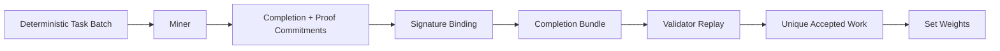
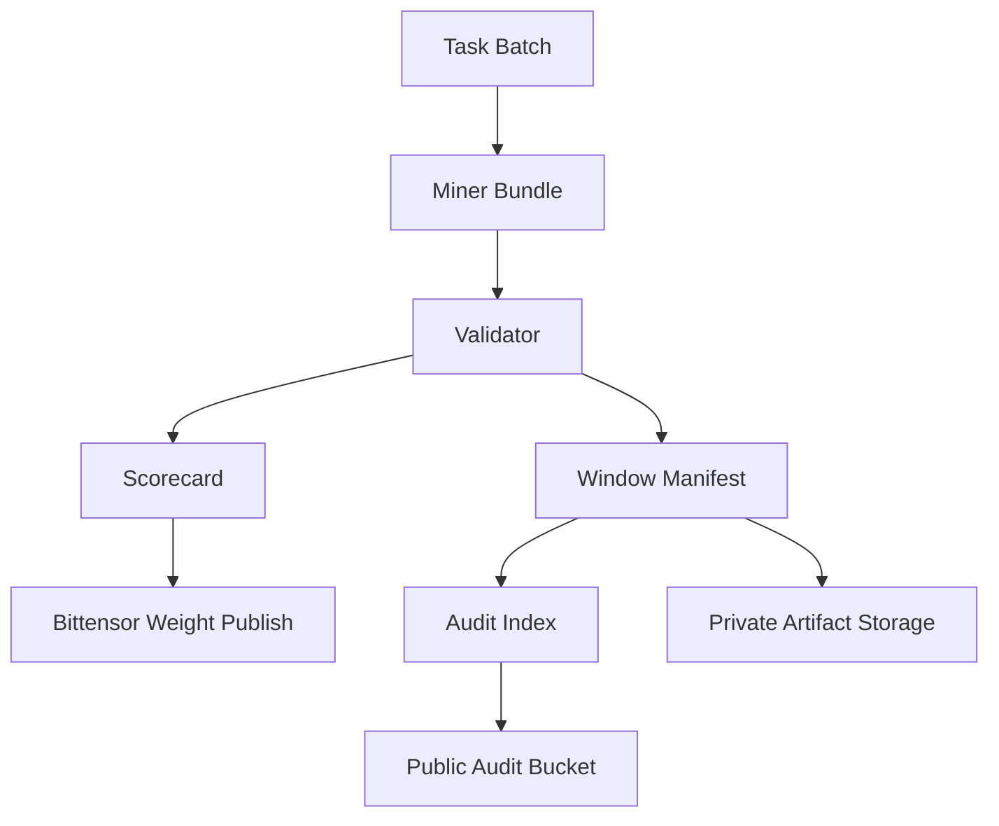

# Reliquary Overview

## Problem

Bittensor can reward useful model outputs, but many inference subnet designs leave a gap between what miners claim they generated and what validators can cheaply verify. That gap grows when the subnet also wants deterministic tasks, uniqueness incentives, and public auditability.

Reliquary narrows that gap by turning **accepted proof-carrying completions** into the commodity instead of raw token volume.

## Operating Model

Each accepted completion is:

- tied to a deterministic task batch
- bound to a declared task source
- signed by the miner identity
- replayable by validators with the same hidden-state extraction path
- filtered for duplicates and copycats
- traceable through manifests and public score summaries

## Miner Path

Miners win by submitting completions that are:

- valid for the active task source
- consistent with the proof commitments
- unique against competing submissions
- early enough to beat copycats on deterministic datasets

The scoring surface is intentionally narrow: unique accepted work gets paid, not raw token count.

## Validator Path

Validators do not trust miner output at face value. They:

1. rebuild or load the exact task batch for the window
2. verify the miner signature and binding fields
3. replay the shared forward path
4. challenge-check the hidden-state sketch commitments
5. reject duplicate nonces, duplicate digests, and dataset copycats
6. publish weights only for accepted unique work

The validator surface stays strict and machine-readable through `verdict`, `scorecard`, and `window_manifest` artifacts.

## Chain Role

Bittensor provides:

- miner and validator identity
- metagraph membership
- weight publication
- incentive coordination

The chain is used for **weights and references**, not as a bulk artifact store. Artifacts stay in object storage or local registry backends, and the public audit surface summarizes what happened per window.

## Live Runtime

The current repository includes:

- local proof-complete demo paths
- live Bittensor `test` reads and writes
- single-GPU Hugging Face miner and validator paths on a real RTX staging box
- R2-backed artifacts
- public audit index
- private-first Prometheus and Grafana monitoring
- deterministic `dataset_prompts` and `reasoning_tasks`

See [status.md](status.md) for the current live snapshot.
