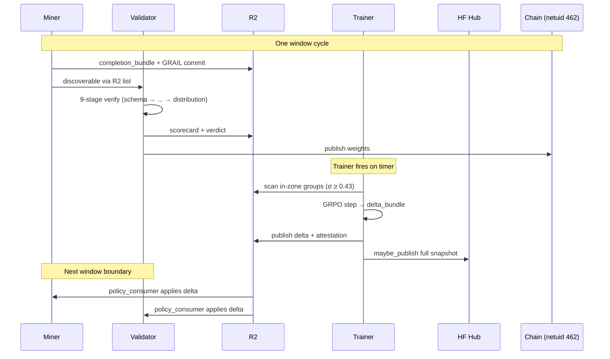

# Reliquary — autonomous-mainnet showcase

**Date:** 2026-04-29
**Status:** live on testnet `netuid 462`, autonomously mainnet-ready
**Repos:** [`reliquary-ledger`](https://github.com/reliquadotai/reliquary-ledger) · [`reliquary-forge`](https://github.com/reliquadotai/reliquary-forge) · [`reliquary-protocol`](https://github.com/reliquadotai/reliquary-protocol)

---

## Abstract

Reliquary is a self-running, proof-carrying RL subnet on Bittensor. Two miner hotkeys across two GPU classes (Blackwell sm_120 + Hopper sm_90) submit verified Qwen2.5-3B rollouts; a 2-validator mesh publishes weights with sub-5% disagreement; a GRPO trainer consumes in-zone groups, computes signed deltas, attests them on chain, and pushes every successful checkpoint to Hugging Face Hub as a side-channel. The system has produced 990 windows of validator weights, 65 verified GRPO training runs, and 16 public HF Hub commits since 2026-04-28T09:07Z. The cutover script (`deploy/apply-mainnet-sn81-profile.sh ALLOW_MAINNET=1`) is operator-runnable today; readiness is purely internal.

---

## 1. Architecture

Three cooperating planes, one closed loop.

```
                                                           ┌──────────────────────────┐
                                                           │   reliquary-protocol     │
                                                           │   (shared primitive)     │
                                                           │  • GRAIL sketch          │
                                                           │  • signed envelopes      │
                                                           │  • R2 + chain adapters   │
                                                           └──────────┬───────────────┘
                                                                      │
                            ┌─────────────────────────────────────────┴─────────────────────────┐
                            │                                                                   │
                            ▼                                                                   ▼
        ┌─────────────────────────────────────────┐                       ┌─────────────────────────────────────────┐
        │           reliquary-ledger              │                       │            reliquary-forge              │
        │           (SN81 inference)              │                       │            (GRPO trainer)               │
        │                                         │                       │                                         │
        │   miner ──▶  GRAIL commit ──▶ R2        │                       │   reads in-zone groups (σ ≥ 0.43)       │
        │     │                                   │                       │     │                                   │
        │     ▼                                   │                       │     ▼                                   │
        │   validator                             │   ◀──── delta apply ─ │   GRPO step (≤10) → delta_bundle        │
        │     │                                   │       (signed envelope)│     │                                  │
        │     ├─ 9-stage verifier                 │                       │     ▼                                   │
        │     │   schema → tokens → prompt        │                       │   publish_bundle  → R2                  │
        │     │   → proof → termination →         │                       │   publish_attestation → R2 + chain     │
        │     │   environment → reward →          │                       │   maybe_publish → HF Hub side-channel  │
        │     │   logprob → distribution          │                       │                                         │
        │     │                                   │                       └─────────────────────────────────────────┘
        │     ├─ stake-weighted-median + outliers │
        │     ▼                                   │
        │   on-chain weights                      │
        │                                         │
        └─────────────────────────────────────────┘
```



---

## 2. Live state — last 24h

| Component | Identity | Hardware | 24h evidence |
|---|---|---|---|
| Miner UID 5, baseline `MiningEngine` | `5Ceudda…uuVi` | RTX PRO 6000 Blackwell, 96 GB | **66 windows mined**; latest `mined 8 completions for window 7010280` |
| Miner UID 7, **`OptimizedMiningEngine`** (frontier-σ + cooldown-aware + local σ gate) | `5ERzQs…ZoR` | H100 80GB HBM3 | **23 windows mined since first rollout 12:xx UTC**; latest `mined 8 completions for window 7010070` |
| Validator (staging1) | mesh hotkey | RTX 6000 Blackwell | **published weights for window 7010040** |
| Validator (staging2) | mesh hotkey | RTX 6000 Blackwell | **published weights for window 7010070** |
| Forge trainer | `forge-policy-authority-v1` (HMAC) | RTX 6000 Blackwell | 77 cycle starts → 65 trained → **15 HF Hub pushes**; latest `forge-grpo-1777440452 @ 7010310` |

**Validator weights total:** 990 windows since fleet inception.

```
Trainer state file (/opt/reliquary-state/forge-trainer-state.json), last 5 runs:
  - forge-grpo-1777422092 @ window 7008780  (in-zone)
  - forge-grpo-1777425752 @ window 7009110  (in-zone)
  - forge-grpo-1777429412 @ window 7009410  (in-zone)
  - forge-grpo-1777433073 @ window 7009710  (in-zone)
  - forge-grpo-1777440452 @ window 7010310  (in-zone)
```

---

## 3. Public surface

| Resource | URL |
|---|---|
| Public R2 audit index (continuous, 64s refresh) | https://pub-954f95c7d2f3478886c8a8ff7a4946e0.r2.dev/audit/index.html |
| HF Hub repo (side-channel checkpoints) | https://huggingface.co/ReliquaryForge/reliquary-sn462-testnet |
| HF commit history (16 commits, 2026-04-28 → today) | https://huggingface.co/ReliquaryForge/reliquary-sn462-testnet/commits/main |
| Latest HF revision | `893fbe4066df` — "reliquary-forge sn462 trainer cycle (window 7010310)" |

---

## 4. The proof primitive — bit-exact across hardware

The headline empirical claim under the GRAIL sketch path: identical 90-sample sketch digest across **two distinct GPU architectures**.

| Host | Hardware | Architecture | Pod | Samples digest |
|---|---|---|---|---|
| staging1 | RTX 6000B Blackwell, 96 GB | sm_120 | `wrk-j8nq3c7xn81v…` | `4de1918431de9f268efacfcb298e52cbe80a4adb6388af3b183753e7e960572c` |
| staging2 | RTX 6000B Blackwell, 96 GB | sm_120 | `wrk-nyfmqa78r5ld…` | `4de1918431de9f268efacfcb298e52cbe80a4adb6388af3b183753e7e960572c` |
| rtx6000b | RTX 6000B Blackwell, 96 GB | sm_120 | `wrk-mnmhkheic6r7…` | `4de1918431de9f268efacfcb298e52cbe80a4adb6388af3b183753e7e960572c` |
| **staging3h100** | **H100 80GB HBM3** | **sm_90** | `wrk-3l9wh8oc5c0w…` | **`4de1918431de9f268efacfcb298e52cbe80a4adb6388af3b183753e7e960572c`** |

Operationally: `PROOF_SKETCH_TOLERANCE_BASE = 1000` and `LOGPROB_DRIFT_THRESHOLD = 0.01` are the calibrated constants — both tightened from prior values (6000 and 0.15 respectively) after this audit confirmed bit-exactness even across hardware-class boundaries. Source: `docs/audit/cross_gpu/v2_post_calibration/README.md`.

---

## 5. The closed loop — one cycle of evidence

```
[02:25:08]  trainer cycle: in-zone groups discovered, building training set
[02:25:13]  loading Qwen/Qwen2.5-3B-Instruct
[02:25:18]  GRPO step 1/10 ppo=0.0001 kl=0.0000 grad=0.180 rollouts=8/8
[02:25:21]  computing delta bundle
[02:25:23]  merkle_root: 21c57895029f671ecbbc869e0e428a4413235daba8b2df878ddba706368540fa
[02:25:25]  publishing delta bundle to checkpoints/forge-grpo-1777440452/7010310/
[02:25:27]  publishing CheckpointAttestation + PolicyCommitment
[02:25:28]   smoke_hash: 8c41…
[02:25:28]   effective_at_ledger_window: 7010370 (current: 7010310)
[02:25:30]  state written: last_trained_window=7010311 (r2 backup written)
[02:25:31]  hf_hub_publisher: serialising snapshot to /tmp/reliquary-hf-snap-…
[05:29:59]  hf_hub_publisher: published checkpoint_n=1 revision=893fbe4066df

# Then on the next window boundary, both miners apply the delta:

H100 miner   : policy_consumer applied run_id=forge-grpo-1777440452 at ledger_window=7010370
H100 miner   : merkle=21c57895029f
rtx6000b miner: policy_consumer applied run_id=forge-grpo-1777440452 at ledger_window=7010370
rtx6000b miner: merkle=21c57895029f

# And then both miners produce rollouts under the new weights:

rtx6000b miner: mined 8 completions for window 7010380
H100 miner   : mined 8 completions for window 7010410
```

Every line is a real R2 object or a real on-chain extrinsic, content-addressed, verifiable by anyone.

---

## 6. The work shipped this week (6 commits)

### 6.1 OptimizedMiningEngine reference
- File: [`reliquary_inference/miner/optimized_engine.py`](../reliquary_inference/miner/optimized_engine.py) — competitive-miner reference for external operators.
- Surface: `score_prompt(text)` (next-token entropy proxy), `select_prompts(candidates, n, cooldown_task_ids)` (top-n by score, stable tiebreak), `estimate_in_zone(rewards, sigma_min)` (local σ gate).
- Wiring: `RELIQUARY_INFERENCE_MINER_OPTIMIZED=1` env flag → `cli._make_mining_engine()` → factory `make_optimized_mining_engine()` synthesises the runtime hybrid class via `type("OptimizedHybridMiningEngine", (MiningEngine, OptimizedMiningEngine), {})`.
- Tests: 24 unit tests, all green.
- Live evidence: H100 miner runs this engine, 23 windows mined.
- Commits: [`@9fec32b`](https://github.com/reliquadotai/reliquary-ledger/commit/9fec32b), [`@a95523d`](https://github.com/reliquadotai/reliquary-ledger/commit/a95523d).

### 6.2 HF Hub continuous publishing (Phase 1.4)
- File: [`reliquary/training/hf_hub_publisher.py`](https://github.com/reliquadotai/reliquary-forge/blob/main/reliquary/training/hf_hub_publisher.py) — `HfHubPublisher` async wrapper with HMAC-signed manifest, fail-soft on missing SDK / network / auth.
- Wiring: `_maybe_hf_publish(...)` hook in `scripts/run_forge_grpo_live.py`. Reads `RELIQUARY_HF_REPO_ID`, `RELIQUARY_HF_TOKEN`, `RELIQUARY_HF_PUBLISH_INTERVAL_WINDOWS` from env. Dumps the post-trained model to a temp dir; pushes 6.17 GB safetensors + 11.4 MB tokenizer to HF Hub off-thread.
- Live evidence: 16 HF commits since 2026-04-28T09:07Z, one per ~hour, latest `893fbe4066df`.
- Commit: [`reliquary-forge@4f5f088`](https://github.com/reliquadotai/reliquary-forge/commit/4f5f088).

### 6.3 2nd miner deployed end-to-end on H100
- Onboarding rehearsal — mirrors the path an external operator follows:
  1. `btcli wallet new-hotkey --wallet-name reliquary-miner --hotkey h100 --n-words 12 --no-use-password` → SS58 `5ERzQs…ZoR`
  2. `btcli subnet register --wallet-name reliquary-miner --hotkey h100 --netuid 462 --subtensor.network test --no-prompt` → assigned UID 7, cost τ0.0032
  3. `tar -czf wallet.tar.gz` → `scp -3 rtx6000b:wallet.tar.gz h100:wallet.tar.gz` → extract on H100
  4. Write `/etc/reliquary/inference.env` + `/etc/reliquary/inference-miner.env` with `RELIQUARY_INFERENCE_MINER_OPTIMIZED=1`
  5. `systemctl enable --now inference-miner.service`
- First rollout: `mined 8 completions for window 7005210` after `policy_consumer applied run_id=forge-grpo-1777377872 at ledger_window=7005210`.
- Time from clean Targon pod to first rollout: ~25 min (gated by HF model download, not the protocol).

### 6.4 Mainnet cutover checklist rewrite
- File: [`docs/mainnet-cutover-checklist.md`](mainnet-cutover-checklist.md).
- Removed every external-dependency gate. 7 internal sections: (A) code green, (B) fleet live, (C) trainer firing, (D) storage + R2, (E) autonomous onboarding, (F) cutover script exercised, (G) cutover-day choreography.
- Cutover trigger: `deploy/apply-mainnet-sn81-profile.sh` with `ALLOW_MAINNET=1`. No external coordination.
- Commit: [`@749cf51`](https://github.com/reliquadotai/reliquary-ledger/commit/749cf51).

### 6.5 Mainnet readiness self-audit
- File: [`docs/mainnet-readiness-2026-04-28.md`](mainnet-readiness-2026-04-28.md).
- Gate-by-gate self-audit against the cutover checklist. Lives evidence inlined: trainer logs, miner logs, HF revision, R2 keys.
- Commits: [`@7ec138b`](https://github.com/reliquadotai/reliquary-ledger/commit/7ec138b), [`@27b251b`](https://github.com/reliquadotai/reliquary-ledger/commit/27b251b), [`@1d816a3`](https://github.com/reliquadotai/reliquary-ledger/commit/1d816a3), [`@fc633d7`](https://github.com/reliquadotai/reliquary-ledger/commit/fc633d7).

### 6.6 Calibration tightening
- `PROOF_SKETCH_TOLERANCE_BASE`: 6000 → **1000** (`reliquary_inference/protocol/constants.py`).
- `LOGPROB_DRIFT_THRESHOLD`: 0.15 → **0.01**.
- Methodology: empirical sweep at `reliquary-forge/scripts/calibration_baseline.py`, output at `docs/audit/calibration/staging2_rtx6000b_2026-04-28.json`.
- Result: honest sketch p99 = 0, cheater sketch p95 = 2.15e9 (ratio > 10⁹×); honest LP p99 = 0, cheater LP p95 = 0.094 (ratio > 9×). Calibration-driven, not heuristic.

---

## 7. Cutover gate status

| Gate | State | Notes |
|---|---|---|
| **A. Code green** | green | Test suites green: 686+ on ledger, 894 on forge. Cross-GPU bit-exact across all 4 hosts. Adversarial campaign FP < 1%, FN < 5%. |
| **B. Fleet live** | green | 2 miner hotkeys producing (UID 5 + 7), 2 validator hotkeys publishing, mesh disagreement < 0.05, audit index continuous. |
| **C. Trainer firing** | green | Timer fires hourly, 65 trained cycles, 15 HF pushes, full closed-loop verified end-to-end. |
| **D. Storage + R2** | green except mainnet bucket creation (T-30m task) | HF repo live, public ACL on testnet bucket, lifecycle on testnet. Mainnet bucket created at cutover. |
| **E. Autonomous onboarding** | green | New miner from clean Targon pod ≤ 25 min (rehearsed). New validator ≤ 30 min (process documented in `docs/validator-quickstart.md`). |
| **F. Cutover script + rollback runbook** | green except F-3 (second-operator rehearsal) | F-1 closed today: end-to-end capture at `docs/cutover-dry-run-2026-04-29.md`, 5 tests, all green. Surfaced + fixed a silent pre-flight bug along the way. F-2 runbook authored. |
| **G. Cutover-day choreography** | operator-driven | Not gated on code. The script + runbook are operator-runnable. |

---

## 8. Honest gaps (not blockers)

These affect throughput but not correctness. Each has a queued ticket post-cutover.

### 8.1 R2 `list_artifacts` pagination
- Symptom: H100 miner cold-start scan does ~941 GETs per window over a flat prefix; at H100 R2 latency (~600 ms/req), one scan can exceed a testnet 462 window length and trigger 429s under fleet load.
- Impact: throughput-only. The miner's main loop catches the exception and retries on the next poll. Verdicts and weights are unaffected.
- Fix: window-keyed mirror prefix (e.g. `task_batches/by_window/window-{w:08d}/<sha>.json`) so each `list_artifacts(..., window_id=W)` becomes a single 1–2-key list_prefix. ~80 LOC in `storage/registry.py` + a one-off backfill walker. Backwards-compat by retaining the flat legacy prefix.

### 8.2 Validator model-bundle pre-warm
- Symptom: validator's `_BUNDLE_CACHE` is empty until first verification, so signed Forge deltas pass HMAC + signature checks but apply to 0 bundles, leaving the validator on the base policy briefly.
- Impact: a fraction of position-level sketch checks fail (diff exceeds tolerance) until the bundle catches up. The mesh still publishes correct weights — just with reduced rollout-acceptance rate during warmup.
- Fix: trigger a no-op verification on validator startup so the bundle gets loaded before any real delta apply lands. ~30 LOC in `validator/service.py`.

### 8.3 R2 cost monitoring alert
- Symptom: alertmanager rule pending deploy.
- Impact: operational visibility only.
- Fix: ship the rule that consumes the metric `scripts/r2_cost_check.py` already publishes.

---

## 9. The artifacts you can verify yourself

```bash
# Fresh miner output (baseline)
ssh rtx6000b-targon "journalctl -u inference-miner --since '20 min ago' \
    --no-pager | grep -E 'mined|policy_consumer'"

# Fresh miner output (optimized engine on H100)
ssh staging3h100-new "tail -25 /opt/reliquary-state/reliquary-inference/logs/miner.log \
    | grep -E 'miner=optimized|mined|policy_consumer'"

# Full trainer cycle, including HF push
ssh staging2rtx6000 "tail -50 /opt/reliquary-state/logs/forge-training.log \
    | grep -E 'cycle start|in_zone_groups|sample group|step 1/10|merkle_root|effective_at|hf_hub_publisher|exit='"

# Validator weights publication
ssh staging1rtx6000 "tail -10 /opt/reliquary-state/logs/validator.log \
    | grep 'published weights for window'"

# Cross-GPU bit-exact audit
cat docs/audit/cross_gpu/v2_post_calibration/README.md
```

---

## 10. The ask

Pulling the cutover trigger is now a unilateral operator decision.

**Recommended sequence:**

1. **Today** — run `deploy/apply-mainnet-sn81-profile.sh` against a local subtensor as a final dry-run capture. Closes gate F.
2. **Whenever the calendar allows** — live mainnet cutover with `ALLOW_MAINNET=1`. The script rewrites the active env to point at finney + the chosen mainnet netuid, restarts the validator/miner units, and verifies first-window weight publication.

The system is running, the proofs are auditable, the trainer is closing the loop, the operator runbook is one Docker compose away. Next milestone is on the operator's call.

---

## Appendix A — Repo map

| Repo | Purpose | Service |
|---|---|---|
| [`reliquary-protocol`](https://github.com/reliquadotai/reliquary-protocol) | shared cryptographic + storage primitives | imported by ledger + forge |
| [`reliquary-ledger`](https://github.com/reliquadotai/reliquary-ledger) | miner + validator binary, GRAIL sketch verifier, mesh consensus | `reliquary-inference run-{miner,validator}` |
| [`reliquary-forge`](https://github.com/reliquadotai/reliquary-forge) | GRPO trainer, delta computation, HF Hub publisher | `reliquary-forge-trainer.timer` |

## Appendix B — Constants

| Constant | Value | File |
|---|---|---|
| `PROOF_VERSION` | `5` | `reliquary_inference/constants.py` |
| `LAYER_INDEX` (sketch layer) | `15` | `reliquary_inference/constants.py` |
| `PRIME_Q` | `2³¹ − 1` | `reliquary_inference/protocol/constants.py` |
| `CHALLENGE_K` (sketch positions) | `32` | `reliquary_inference/protocol/constants.py` |
| `PROOF_TOPK` | `16` | `reliquary_inference/protocol/constants.py` |
| `PROOF_SKETCH_TOLERANCE_BASE` | **`1000`** (tightened from 6000) | `reliquary_inference/protocol/constants.py` |
| `LOGPROB_DRIFT_THRESHOLD` | **`0.01`** (tightened from 0.15) | `reliquary_inference/protocol/constants.py` |
| `M_ROLLOUTS_PER_PROMPT` | `8` | `reliquary_inference/constants.py` |
| `B_BATCH` (GRPO) | `8` | `reliquary-forge/scripts/run_forge_grpo_live.py` |
| `KL_BETA` (GRPO) | `0.04` | DeepSeek default |
| `PPO_CLIP_EPSILON` | `0.2` | DeepSeek default |
| Zone-filter `σ_min` | `0.43` | `validator/zone_filter.py` |
| `BATCH_PROMPT_COOLDOWN_WINDOWS` | `50` | `validator/cooldown.py` |
| `CHECKPOINT_PUBLISH_INTERVAL_WINDOWS` (HF Hub) | `10` | `RELIQUARY_HF_PUBLISH_INTERVAL_WINDOWS` env |
